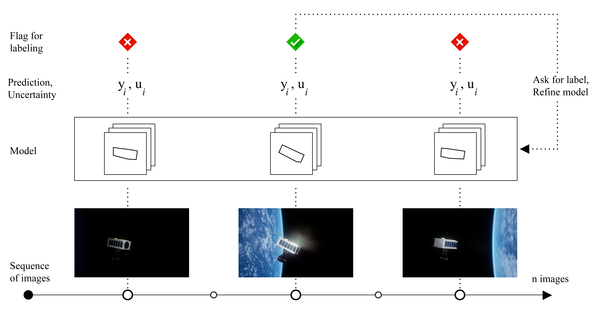

# Data Lifecycle Management for Aerospace Applications
This repository contains the code for the paper 

> [Data Lifecycle Management in Evolving Input Distributions for Learning-based Aerospace Applications]() by Somrita Banerjee, Apoorva Sharma, Edward Schmerling, Max Spolaor, Michael Nemerouf, and Marco Pavone, presented at AI4Space Workshop, ECCV, 2022.

## Download datasets
* ExoRomper -- A subset of ExoRomper images and ground truth labels is available in this repository in `datasets/exoromper`. The results of the paper can be reproduced using this subset. For the full ExoRomper dataset, please contact the authors at [somrita@stanford.edu](mailto:somrita@stanford.edu).
* SPEED -- The dataset can be downloaded from [https://kelvins.esa.int/satellite-pose-estimation-challenge/data/](https://kelvins.esa.int/satellite-pose-estimation-challenge/data/).

## Visualize datasets
* `visualize_images.ipynb`: a Jupyter Notebook that plots images from the datasets both in their original form and modified with added degraded pixels.
* `visualize_pose.ipynb`: a Jupyter Notebook for inspecting the datasets: it plots example images, pose label is visualized by projected axes.

## Train a model
Run Jupyter notebook `train.ipynb`.
* Training functions are in `scripts/train_functions.py`
* Utility functions are in `scripts/utils.py`
* Model checkpoint, best model, and losses are stored in `checkpoint/`, `best_model/`, and `losses/` respectively.

## Apply a SCOD wrapper
Run Jupyter notebook `apply_scod.ipynb`.
* SCOD is the algorithm Sketching Curvature for Out-of-Distribution Detection developed in 

> Sharma, Apoorva, Navid Azizan, and Marco Pavone. "[Sketching curvature for efficient out-of-distribution detection for deep neural networks](https://proceedings.mlr.press/v161/sharma21a/sharma21a.pdf)."  Uncertainty in Artificial Intelligence. PMLR, 2021.
* SCOD code in `scod/`. Also available [on Github](https://github.com/StanfordASL/SCOD). 
* Applies a SCOD wrapper to the last parameters of the trained model
* Plots Mean Squared Error (MSE) of model predictions (predicted - true)
* Plots SCOD uncertainty estimate
* Shows that high SCOD uncertainty correlates with high MSE of predictions

## Evaluation benchmark
Run Jupyter notebook `evaluation_benchmark.ipynb`.
* Randomly selects a benchmark set of images from a configurable mix of categories
* Loads trained model, applies SCOD wrapper
* Compares data lifecycle performance of multiple flagging algorithms (including DS-SCOD)
* Benchmark functions are in `scripts/benchmark_functions.py`
* Interface details below. Output costs and accuracies are stored in `saved_data/`

> **Note** 
> ## Interface details: `eval_flaggers` 
> ### Inputs: 
> * `flaggers_to_test`: List of flagging algorithms to compare. Each algorithm should be defined as a lambda function that takes in a sequence `x` and returns a list of boolean flags with length equal to that of `x`. Examples:
>     * Naive_false - flags *none* of the images, always returns false \
        `lambda x: [False for i in range(len(x))]`
>     * Naive_true - flags *all* of the images, always returns true \
        `lambda x: [True for i in range(len(x))]`
>     * Random with budget of 10, i.e. select 10 images from each batch randomly \
    `lambda x: random_flagger(x, flag_limit=10, seed=49)`
>     * SCOD with budget of 10, i.e. select 10 images from each batch with greatest uncertainty \
     `lambda x: scod_flagger(x, unc_model, flag_limit=10)`
>     * DS-SCOD with budget of 10, i.e. select up to 10 images from each batch that maximize information gain \
     `lambda x: ds_scod_flagger(x, unc_model, flag_limit=10)`
> * `load_model_path`: Path to saved model
> * `test_seq`: Test images (batched or sequential)
> * `labels`: Ground truth labels \
> ### Outputs:
> * `costs`: Cumulative cost of labeling (1.0 for each image labeled) 
> * `accs`: Rolling prediction accuracy (currently evaluated as negative mse loss), averaged over each batch 
> * `accs_std`: Standard deviation of prediction accuracy

## Visualize results of evaluation benchmark
Run Jupyter notebook `visualize_benchmark_results.ipynb`.
* Compare different algorithms by plotting average model performance vs. cumulative labeling cost. 
* View time-series performance on breakouts such as only space images, only earth images, etc.

